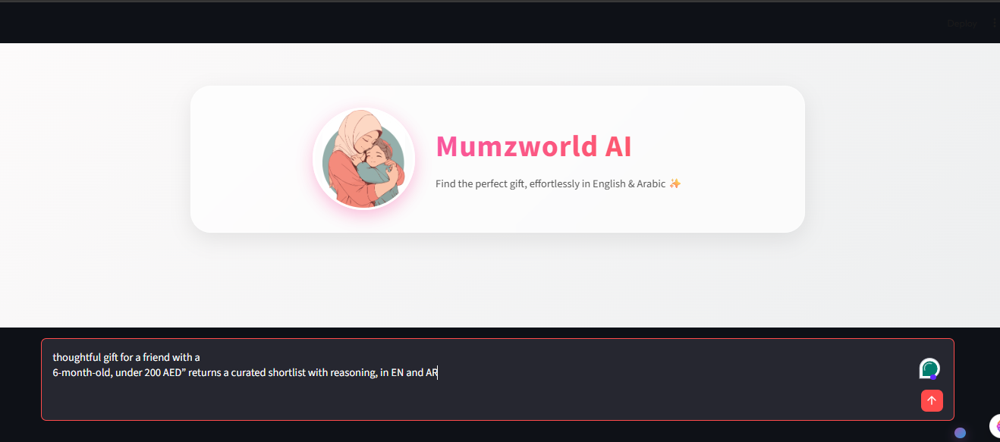
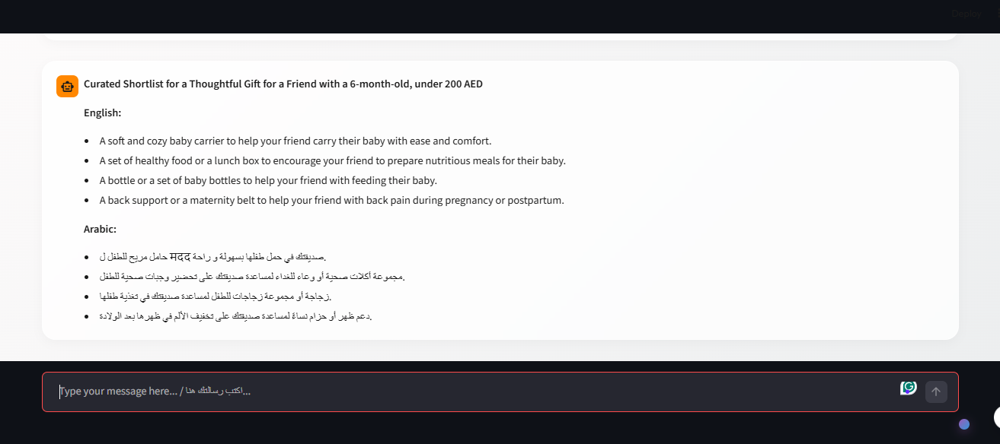

# Mumzworld AI Gift Finder 🎁

Mumzworld AI Gift Finder is an intelligent, bilingual (English & Arabic) conversational assistant designed to help users find the perfect gifts for children and mothers. Built with Streamlit, the application features a premium glassmorphic UI, voice-to-text input, and an AI agent powered by LangChain.


# Website link 

https://mumzworld.onrender.com

## Screenshot






## Features ✨

- **Bilingual Support:** Understands and responds seamlessly in both English and Arabic.
- **Voice Recognition:** Integrated microphone functionality allows users to speak their queries instead of typing them.
- **Smart AI Agent:** Uses advanced language models (via LangChain) to parse requirements (age group, budget, interests) and recommend the best products.
- **Modern UI:** A stunning, fully responsive glassmorphic chat interface with dynamic gradient styling.
- **Database Integration:** Queries a local SQLite database of gifts to provide accurate recommendations.

## Project Structure 📁

- `app.py`: The main Streamlit application file containing the UI layout, CSS styling, and chat loop.
- `agent.py`: Contains the LangChain agent logic, prompting, and LLM configuration for processing queries.
- `internal_tools.py`: Houses utility functions such as `transcribe_audio` for the voice-to-text functionality and `text_to_speech`.
- `db_setup.py`: A script to initialize and populate the `gifts.db` SQLite database with dummy product data.
- `gifts.db`: The local SQLite database containing product information.
- `run.bat`: A convenient Windows batch script to launch the application.
- `.env`: Environment variables file (contains your API keys).
- `requirements.txt`: List of Python dependencies.

## Prerequisites ⚙️

- Python 3.8+
- [Git](https://git-scm.com/) (Optional, for version control)
- A valid API key for your LLM / STT provider (e.g., Groq, OpenAI) to be placed in the `.env` file.

## Installation 🚀

1. **Clone or Download the repository:**
   Navigate to the project directory:
   ```bash
   cd d:\projects\mumzworld
   ```

2. **Create a Virtual Environment (Optional but recommended):**
   ```bash
   python -m venv venv
   venv\Scripts\activate
   ```

3. **Install Dependencies:**
   ```bash
   pip install -r requirements.txt
   ```

4. **Set up your Environment Variables:**
   Ensure your `.env` file is properly configured with your API keys.

5. **Initialize the Database:**
   If `gifts.db` doesn't exist or you want to reset it, run:
   ```bash
   python db_setup.py
   ```

## Running the Application 🏃‍♂️

You can easily launch the application using the provided batch script:

```bash
run.bat
```

Alternatively, you can run it directly via Streamlit:

```bash
streamlit run app.py
```

The app will open automatically in your default web browser.

## Customization 🎨

The UI is highly customizable. You can modify the color schemes, layout, and microphone button positioning directly within the CSS block located at the top of `app.py`.
"# mumzworld" 
